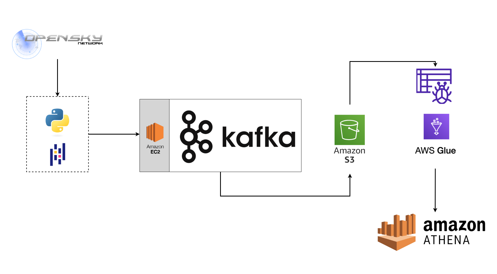

# Overview

This project implements batch processing of data pulled through API calls made to OpenSky. Transformations to the data are made using Python and Pandas before a `producer` and `consumer` process the event concurrently through a `Kafka` server that's hosted on an EC2 instance. The event is then pushed to an S3 bucket as individual json files, where a `crawler` extracts a schema and updates a table. 

# System Architecture



## Pre-requisites

1. OpenSky account
2. AWS account and an IAM user that has the AdministratorAccess permission set
3. EC2 machine
    - Machine Image: Amazon Linux 2 AMI (HVM) - Kernel 5.10, SSD Volume Type
    - Instance type: t2.micro
        - Kafka 2.12-3.8.0
        - Java 1.8.0

# Procedure

* With EC2 instance set up and key pair (.pem file) stored in project root directory, run command:
```
chmod 400 "{EC2 instance name}.pem"
```

* SSH into the machine
```
ssh -i "kafka-stock-market-streaming.pem" ec2-user@{EC2 Public IPv4 DNS}.com
```

* Download and extract Kafka
```
wget https://downloads.apache.org/kafka/3.8.0/kafka_2.12-3.8.0.tgz
```

```
tar -xvf kafka_2.12-3.8.0.tgz
```

```
cd kafka_2.12-3.8.0/
```

* Install Java
```
sudo yum install java-1.8.0-openjdk
```

* Configure DNS in `server.properties` file
```
sudo nano config/server.properties
```

* Uncomment line and replace `your.host.name` with EC2 public DNS
    - `advertised.listeners=PLAINTEXT://**your.host.name**:9092`

* Starting up Zookeeper server
```
bin/zookeeper-server-start.sh config/zookeeper.properties
```
* Starting up Kafka server (in a new terminal)
```
export KAFKA_HEAP_OPTS="-Xmx256M -Xms128M"
```
```
bin/kafka-server-start.sh config/server.properties
```